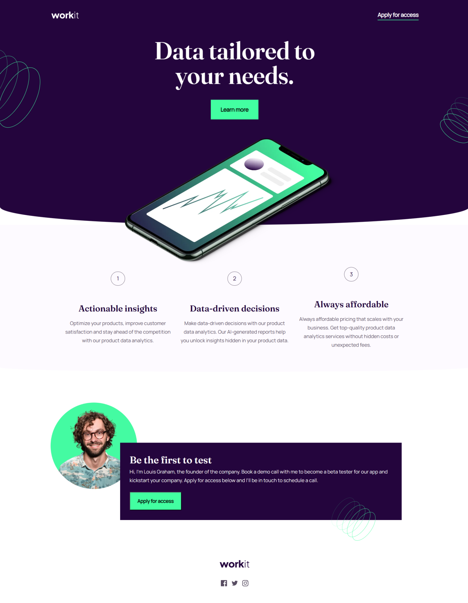

# Frontend Mentor - Workit landing page solution

This is a solution to the [Workit landing page challenge on Frontend Mentor](https://www.frontendmentor.io/challenges/workit-landing-page-2fYnyle5lu). Frontend Mentor challenges help you improve your coding skills by building realistic projects.

## Table of contents

- [Overview](#overview)
  - [The challenge](#the-challenge)
  - [Screenshot](#screenshot)
  - [Links](#links)
- [My process](#my-process)
  - [Built with](#built-with)
  - [Continued development](#continued-development)
  - [Useful resources](#useful-resources)
- [Author](#author)
- [Acknowledgments](#acknowledgments)

**Note: Delete this note and update the table of contents based on what sections you keep.**

## Overview

### The challenge

Users should be able to:

- View the optimal layout for the interface depending on their device's screen size
- See hover and focus states for all interactive elements on the page

### Screenshot

### Links

- Solution URL: [Github](https://github.com/tunde-james/workit-landing-page)
- Live Site URL: [Live URL](https://workit-landing-page-mu.vercel.app/)

## My process

### Built with

- Semantic HTML5 markup
- CSS custom properties
- Flexbox
- Mobile-first workflow

### Continued development

I would focus more on understanding the Positional Layout, and get better at using position property with the different values available.

I would also explore CSS Grid in my next project, as well as accessibilty for screen readers.

### Useful resources

- [css for js developers](https://courses.joshwcomeau.com/css-for-js/02-rendering-logic-2/01-positioning) - This helped me with understanding the position layout.

## Author

- Website - [Tunde James]
- Frontend Mentor - [@tunde-james](https://www.frontendmentor.io/profile/tunde-james)
- Twitter - [@TundeJames_20](https://twitter.com/TundeJames_20)
